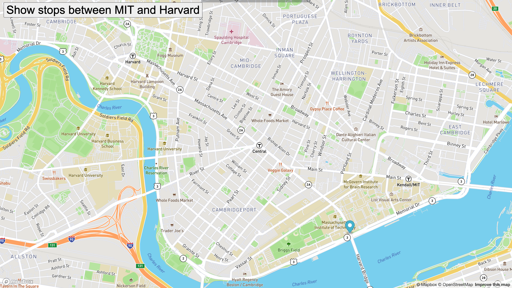

# Real-Time-Bus-Tracker Exercise

The exercise utilizes asynchronous javascript to generate markers for specific bus routes on a map of downtown Boston, MA.  The map is generated by use of a URL link to Google Maps and the bus schedules are provided by MBTA.  The program makes a call to the URL every 15 minutes to update the locations of the specified buses.

How To Use

This program requires a specific user generated API key provided by registering at Google Maps.  This key must then be entered on line 4 of the html file in place of "API KEY HERE".  Once entered, the file may be opened within the browser, and will automatically update every 15 minutes.

Roadmap To Future Improvements

This file provides a template which may be adjusted for different locations and bus data.  Through use of API's like Google Maps, virtually any location could be rendered and there are many URLs similar to MBTA to obtain real-time transit updates.

